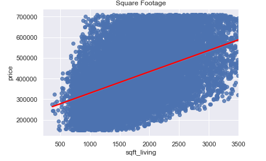

# house-sales-regression-model
## Contributors 
- Deric Williamson
- Eric Cusick

## Business Case
A home renovation contract team has employed the services of data scientists to create a model predicting how much a house will sell for in the King County, WA area. 

Given the 'kc_house_data.csv' file, the data scientist team is expected to:

- Build an accurate predictive model
- Report some of the primary features of a house that will increase the price so the company will know what to focus their efforts on
- Build a calculator that represents the model

## Exploratory Data Analysis (EDA)
In this stage, we took an in-depth look into every column. For the sake of making our regression model accurate, we dealt with all outliers and checked for feature linearities. Histograms and Boxplots are a nice tool to find outliers. Scatter plots work nicely for a quick visualization for linearity. This is also where we made decisions on what kind of data would belong in our model. 

We restricted our data to provide a more meaningful relationship to our model by analyzing data from the house price range of $150,000 to $710,000.
- TODO Add Price Histogram pic from powerpoint

Some other house features were analyzed and corrected from possible outliers, data types, and missing data. For regression accuracy purposes, we decided to drop house square footage data that was above 3,500 square feet. The graph reflects linearity. On average, a house with more than one floor will sell at a higher price than a home with only a single floor. 
- TODO Add Square footage scatterplot picture

- TODO add Average price per floor picture

In King County, the location of the home can have a large impact on how expensive the home sells for. The graph shows the more expensive homes in the county are towards the northside, and lower priced homes are in the south. 
- TODO add zipcode scatterplot

We categorized zipcode into four different categories based off of frequency of the zipcode in the data and price.
- TODO add 3 zipcode pictures

## Preprocessing Data 
In this phase, we handled our correlated and categorical features. Once we finished this step we were able to use this data set for our first regressive model. The idea behind regression is that you should be able to change one predictor and observe the change in outcome. This is where the error of multicollinearity comes in. Instead of changing one predictor, there might be a change in other predictors due to high multicollinearity. We are using 'One-Hot encoding' to deal with these categorical features. We did this by turning our categorical features into multiple binary features, so our algorithm did not use our categorical features as a continuous feature.

## Modeling Proces
During the modeling process, we:
- Removed collinear variables  
  * Highly correlated features will alter after changing one feature

- Detecting high P-values  
  * High p-values assume there is little to no relationship in outcome

- Log transformed house square foot 
  * Will help with model accuracy

- Categorized zipcode into four categories
  * Zipcodes were categorized by price and frequencies found in raw data

## Final Model
- TODO add pp final model pic

## Predictive Function
Lastly, we added a predictive function to calculate the estimated price of a house based off the linear regression line.
- TODO add calculator photo

## Recommendations
Looking at our model, we recommend:

- Size, location and the number of floors have the biggest influences on house prices
  * More expensive homes are located on the northside of the county, while less expensive homes are in the south

- It's better to have an additional bathroom over an additional bedroom

- Year Built has the lowest impact on resale price

We believe that the renovation team will be able to utilize this information to make sound decisions. To potentially increase their profits and work with efficiency when fixing homes.

